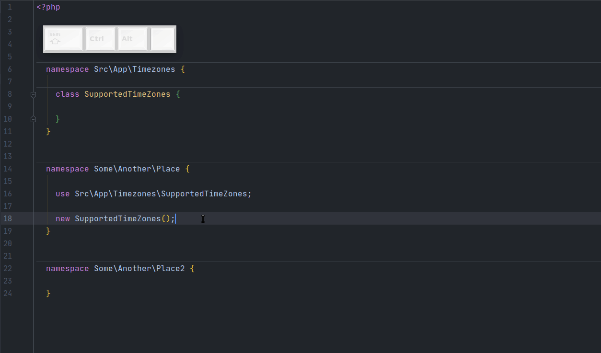
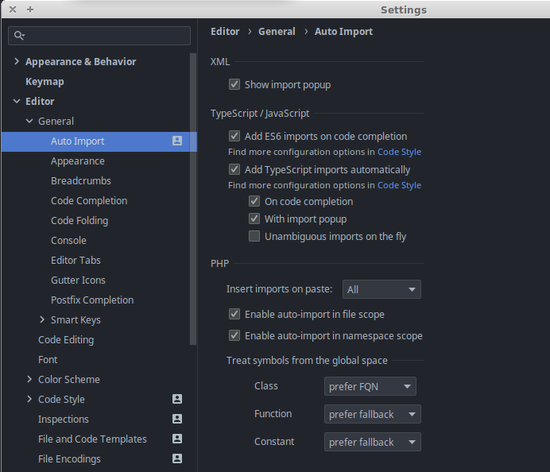

# Auto Import
Settings -> Editor -> General -> Auto Import

Нас интересует блок PHP.

Первая настройка -  `Insert imports on paste`, выбираем `All`.
Теперь при копипасте кода PhpStorm не будет спрашивать, надо ли импортировать классы.

 

Следующая настройка - условия срабатывания автоимпорта.

Ставим галочки `Enable auto-import in file scope` и `Enable auto-import in namespace scope`.
> Также настоятельно рекомендую выбрать `Treat symbols from the global space -> Class -> prefer FQN`.
> Иначе автоимпортиться будут классы из глобального неймспейса, что совершенно бессмысленно :man_shrugging:.  

 

Вот так выглядят мои настройки на текущий момент (PhpStorm 2020.1):

