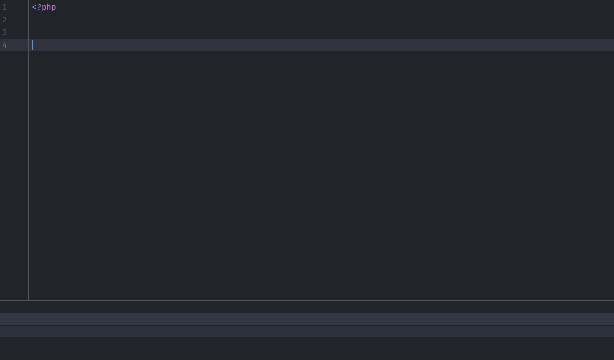
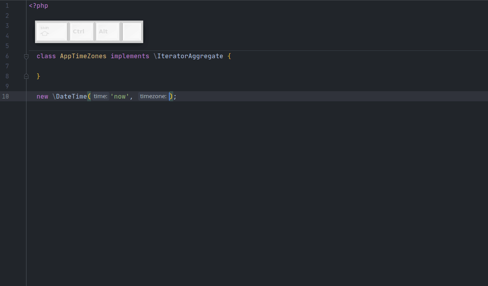
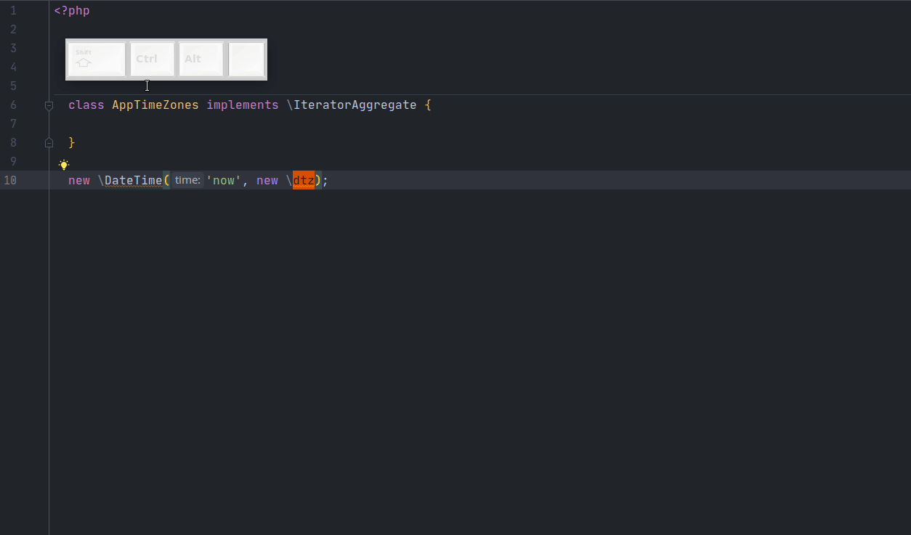
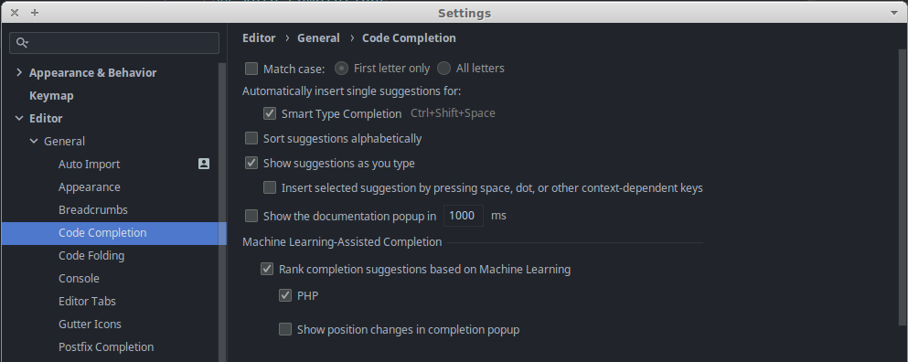

# Code completion
Это классическое автодополнение кода при наборе названия
- класса
- метода
- переменной
- etc.

Обучаться чему-то хитрому при использовании автодополнения не нужно. Но можно подкрутить настройки PhpStorm для более комфортного использования.

Переходим в `Settings -> Editor -> General -> Code completion`

Первым делом снимаем галочку с `Match Case`: теперь PhpStorm не будет учитывать регистр при поиске классов:

 

Затем включаем `Automatically insert single suggestions for: - Smart Type Completion`

В PhpStorm есть 2 типа авто-дополнения: стандартный "Completion" (Ctrl+Space) и умный - "Smart Type Completion" (Ctrl+Shift+Space).

Стандартный "Completion" мы видим по умолчанию, например, когда начинаем набирать название класса. При составлении вариантов стандартного дополнения PhpStorm учитывает только названия, упуская контекст их использования (области видимости, тип аргументов и т.д.).

Smart Type Completion при составлении вариантов дополнения учитывает контекст. Например, тип аргумента вызываемого метода:

Smart Type Completion вызывается комбинацией `Ctrl+Shift+Space`.

 

При включении `Automatically insert single suggestions for: - Smart Type Completion` PhpStorm автоматически вставит вариант дополнения при вызове Smart Type Completion, если существует только 1 подходящий вариант: 

 

Также советую включить `Machine Learning-Assisted Completion` для PHP. PhpStorm будет анализировать, какие варианты авто-дополнения вы выбираете чаще и поднимать их повыше в списке.

---

Вот так выглядят мои настройки на текущий момент (PhpStorm 2021.3.1 Build #PS-213.6461.83, built on December 29, 2021):

