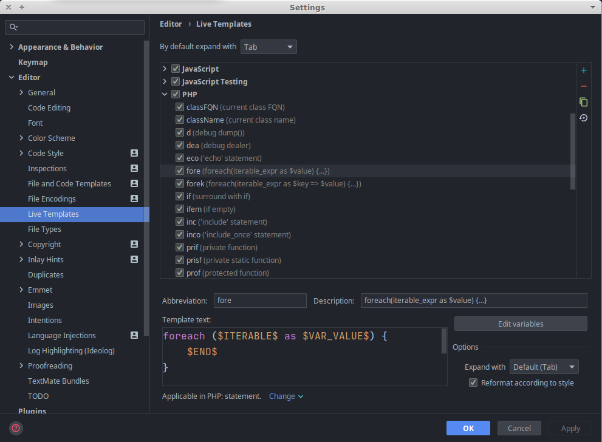
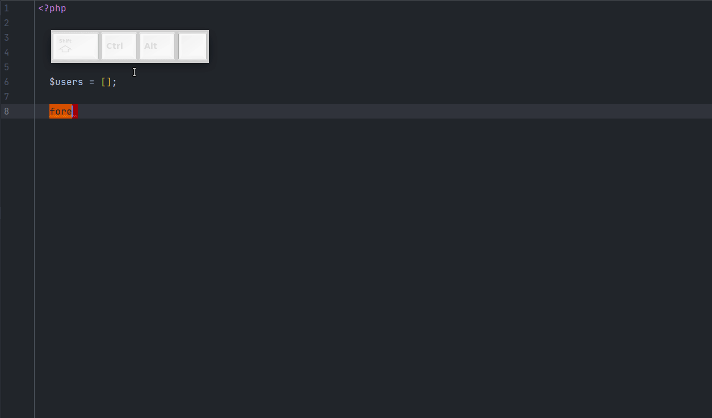
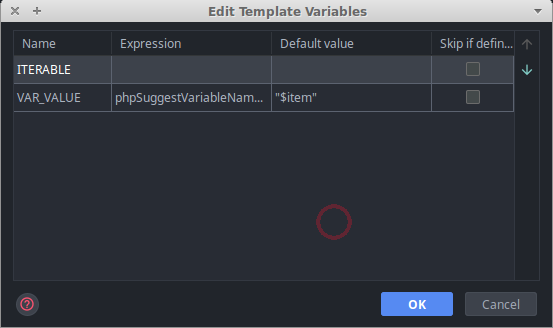

# Live templates
Во время разработки мы часто печатаем стандартные, повторяющиеся структуры, с небольшими отличиями: циклы, if-ы, объявляем методы, бросаем исключения и т.д. <br/>
Live templates позволяет автоматизировать создание этих структур.

В PhpStorm есть ряд стандартных live темплейтов, давайте рассмотрим один для примера, переходим в<br/> 
Settings -> Editor -> Live Templates -> PHP -> fore


<br/>

Поле | Описание
---- | --------
`Abbreviation` | сокращение нашего темплейта, по сути шорткат, по которому он вызывается
`Description` | описание темплейта (отображается рядом с аббревиатурой в списке темплейтов и при выводе в списке completions)
`Template text` | собственно сам темплейт
`Options: expand with` | "горячая клавиша", при нажатии которой будет разворачиваться темплейт 
`Options: reformat according to style` | после разворачивания темплейта он будет отформатирован согласно вашим настройкам Code Style
`Applicable in *; statement. Chandge` | контекст, в котором этот темплейт может развернуться

И также у нас есть кнопка `Edit Variables`, ее мы рассмотрим позже

Итак, содержание темплейта `fore`:
```php
foreach ($ITERABLE$ as $VAR_VALUE$) {
    $END$
}
```   

`$ITERABLE$`, `$VAR_VALUE$` - это "пользовательские" переменные.<br/>
В процессе разворачивания темплейта каретка ввода будет поочередно подставляться на место каждой переменной. После того, как мы закончили ввод кода на месте переменной `$ITERABLE$` нужно нажать Enter или Tab и мы автоматически перейдем к заполнению следующей переменной - `$VAR_VALUE$`.

`$END$` - это стандартная переменная, она обозначает, что в этой точке нужно остановить каретку ввода, когда темплейт развернется:


<br/>

На гифке можно наблюдать еще одну особенность - массив `$users` мы выбираем вручную, а значение `$user`, на место `$VAR_VALUE$`, подставляется автоматически. Как это происходит?<br/>
Дело в настройках переменных, которые прячутся под кнопкой `Edit Variables`. Нажимаем на нее и видим следующее окно:<br/>


Все пользовательские переменные добавляются в эту табличку автоматически. В табличке есть 4 колонки:

Название | Описание
-------- | -------------------
`NAME` | название переменной
`Expression` | спец. функция, которая будет применена к переменной. Их достаточно много, почитать про них можно [тут](https://www.jetbrains.com/help/phpstorm/template-variables.html#predefined_functions). На примере переменной `$VAR_VALUE$` можно увидеть, что для нее установлен expression `phpSuggestVariableName()`. Как нетрудно догадаться, именно благодаря этому PhpStorm пытается угадать название переменной. Важный нюанс, для работы `phpSuggestVariableName()` **дефолтное значение должно быть заполнено**.
`Default value` | Ничего особенного, но есть нюанс. Дефолтное значение также является выражением, которое может ссылаться на другой Live Template. Если ваше дефолтное значение - литерал, оно должно быть обернуто в двойные кавычки, напр. `"$item"`
`Skip if defined` | PhpStorm не будет останавливаться на месте этой переменной, если ее значение уже заполнено.

<br/>

Для примера, вот мой темплейт `fore` для HTML контекста
```php
<? foreach ($ITERABLE$ as $VAR_VALUE$) { ?>
    $END$
<? }?>
```
Настройки переменных идентичны оригинальному `fore`. Этот темплейт я использую для написания `foreach` во вьюшках.<br/>
Также для HTML контекста у меня есть темплейты для вызова глобальных функций перевода, экранирования, установки layout, разворачивания `if` и т.д. Это мощный инструмент, который ограничивается только вашей фантазией и желанием оптимизировать свой workflow. :nerd_face:
