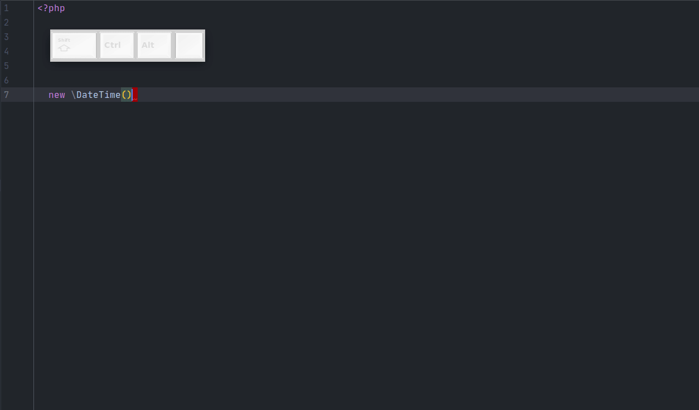
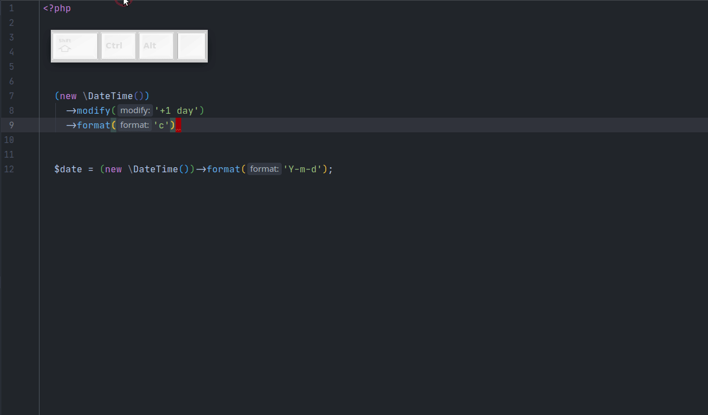

# Postfix Completion
Позволяет проводить манипуляции с выражениями. К сожалению, в отличие от `Live Templates` не такой гибкий в настройке, но все равно очень полезный.

Покажу, что он умеет, на примере: 

 

Мой шаблон `.w` оборачивает любое выражение в скобки и добавляет стрелку `->`.  

Чтобы настроить себе такой, переходим в `Settings -> Editor -> General -> Postfix Completion`. Тут же можно посмотреть примеры стандартных Postfix Completions.

1. Нажимаем на плюс;
2. Выбираем PHP;
3. В Key пишем w, жмем ок.

В создавшемся Postfix Completion уже заполнено поле "before": `$EXPR$.w`

В "after" пишем `($EXPR$)->`, сохраняем.

Теперь любое выражение можно обернуть в `()->`.

---

P.S. Postfix Completion работает со всем выражением, ему не важно, разбито ли оно на несколько строк, присваивается ли в переменную и т.д. 
Вот мой Postfix Completion `.d`, для вызова [symfony/var-dumper](https://github.com/symfony/var-dumper):

