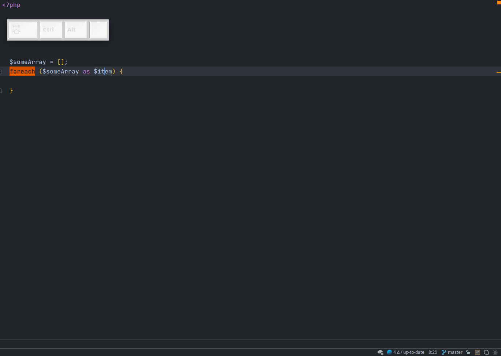

# Macros

Достаточно стандартный инструмент, позволяет записать любой набор действий и повесить на них шорткат. 
Поочередно воспроизводит каждое действие. Иногда может тупить/ломаться, потому советую уделить большее внимание таким инструментам как [Live Templates](/docs/Completions/LiveTemplates.md) и [Postfix Completion](/docs/Completions/PostfixCompletion.md).
Но все же иногда бывает полезен.

Запись макроса:
- File -> Macros -> Start Macro Recording
- Выполняете желаемую последовательность действий
- Нажимаете на кнопку остановки записи макроса (PhpStorm 2020.1+) либо File -> Macros -> End Macro Recording
- Вводите желаемое имя макроса

Совет: на макрос стоит назначить шорткат.

