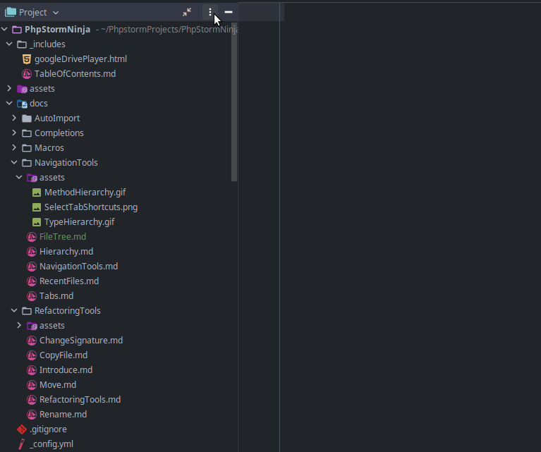

# File Tree
> Эта страница документации достаточно сильно завязана на мои личные предпочтения.

Настало время поговорить о `File Tree` - еще одном блоке, который  крадет у нас много экранного места. Сразу скажу, в этом случае нет никакого альтернативного чудо инструмента. `File Tree` незаменим. И на мой взгляд он замечательно выполняет свою работу, так что и заменять его нет смысла. Но, есть пару нюансов, как можно оптимизировать работу с ним.

## Hide File Tree
Когда вы сосредоточены на разработке кода в одном или нескольких файлах - попробуйте скрыть `File Tree`, это легко делается стандартным шорткатом `Atl+1` (этим же шорткатом можно его вернуть).
> Если каретка ввода находится внутри файла - `Atl+1` активирует окно `File Tree`, для скрытия окна нажмите `Atl+1` еще раз.

Когда вы впервые скроете `File Tree` вам понадобится некоторое время на адаптацию. Глаза сами будут "тянуться" к тому месту, где раньше была левая граница кода. Просто дайте себе адаптироваться. А когда привыкнете - вы кайфанете, от того насколько больше места для кода у вас стало, особенно если у вас крупный кегль шрифта.

 

Окей, вы свернули `File Tree`, что дальше, как без него? Принцип простой - не используем файловое дерево, когда оно не нужно.

**Навигация между файлами** 
Намного быстрее осуществлять навигацию по файлам с помощью [Recent Files]({{ site.baseurl }}) (в случае, если вы недавно посещали/редактировали нужный файл). Для поиска классов/файлов, примерное название которых вы знаете, намного быстрее использовать `Navigate to Class` (`Ctrl+N`) или `Navigate to File` ([https://www.jetbrains.com/help/phpstorm/searching-everywhere.html](https://www.jetbrains.com/help/phpstorm/searching-everywhere.html)).

**Создание файлов** 
Не создавайте файлы мышкой! Файлы можно создавать без помощи мышки и `File Tree`, используйте для этого [Navigation Bar](https://www.jetbrains.com/help/phpstorm/guided-tour-around-the-user-interface.html#navigation-bar). Активировать `Navigation Bar` можно шорткатом `Atl+Home`, вызвать меню создания файла шорткатом `Atl+Insert`.

Также активированный `Navigation Bar` можно использовать для навигации в текущей директории.

 

> **В остальных ситуациях, когда работать с `File Tree` реально удобнее - я использую `File Tree`.**

 

## Settings
Также мы можем оптимизировать настройки `File Tree`, для более комфортной работы.

### Indents
Если вас раздражают, что в длинных неймспейсах в `File Tree` появляется горизонтальная прокрутка - попробуйте настройку `Use smaller indents in trees`, в `Settings -> Appearance & Behaviour -> Appearance`, раздел `UI Options`.

### Open Files with Single Click
Включив эту опцию, файлы будут открываться одним кликом, а не двойным. Также при навигации с помощью клавиатуры выбранный файл будет автоматически открываться через ~0.5 секунды после того, как вы перестали перемещаться по дереву. 
Настройка прячется за тремя точками, в шапке `File Tree`. 

 

### Always Select Opened File
После включения этой опции `File Tree` будет автоматически прокручиваться до открытого файла, при переключении между файлами с помощью [Recent Files]({{ site.baseurl }}), Navigate to Class, вкладок и других инструментов навигации. Настройка находится под `Open Files with Single Click` (см. гифку выше).
