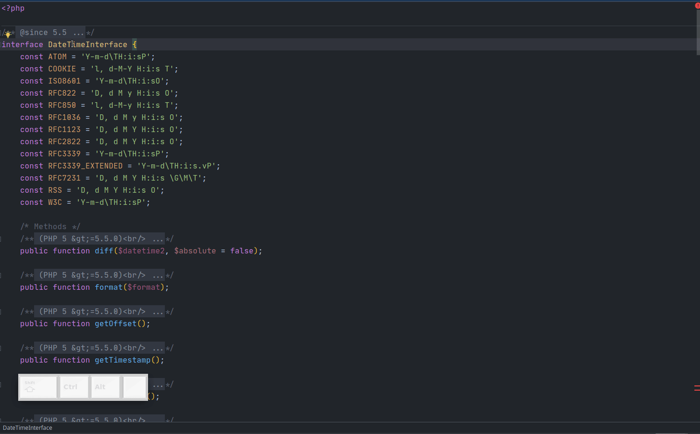
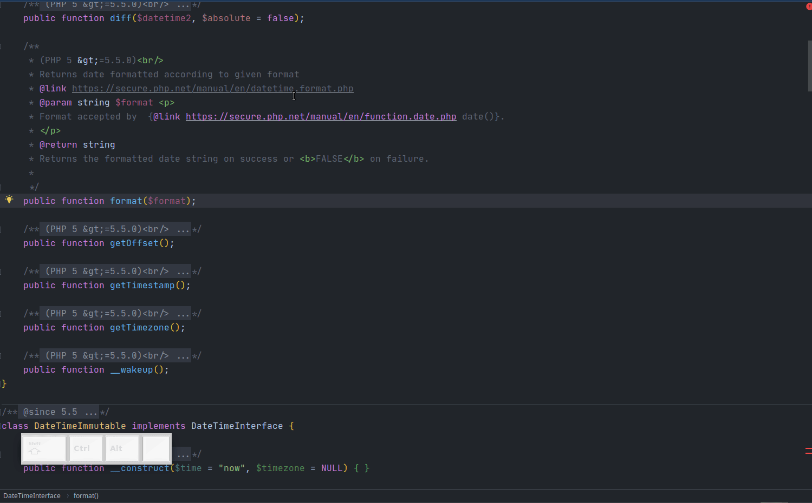

# Hierarchy

Еще один очень удобный и полезный инструмент в PhpStorm, о котором мало кто знает - дерево иерархии.

## Type Hierarchy

Переместите каретку ввода на название или в любое место в теле интерфейса и вызовите action `Type Hierarchy`, шорткат по умолчанию `Ctrl+H`.
Вы увидите окно, с деревом иерархии типа. По умолчанию выводится иерархия `subtypes`, выбрав соответствующую иконку в окне `Type Hierarchy` можно отобразить `supertypes`. 
Последнее я использую достаточно редко, а вот `subtypes` это очень удобная штука, когда надо посмотреть, кто реализует интерфейс или наследует класс. 

 

## Method Hierarchy

То же, что и `Type Hierarchy`, только с методами. Невероятно удобно, когда надо например пробежаться по всем реализациям метода интерфейса. Стандартный шорткат `Ctrl+Shift+H`, каретка ввода должна находиться на названии метода. 
