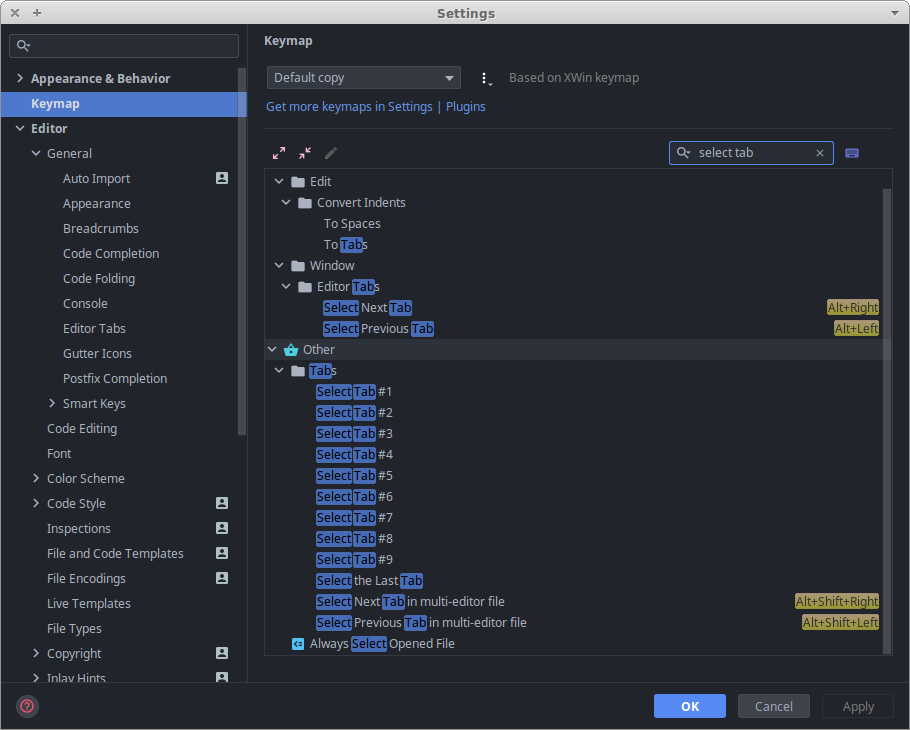

# Tabs

Первый инструмент в списке `Navigation Tools`, о котором я хочу рассказать - это вкладки. Но первый он не потому, что он лучше всех, а потому, что хуже.

Давайте рассмотрим pros & cons этого инструмента. Начнем с плюсов:
- наглядно видно некоторое количество открытых файлов;
- интуитивно, вкладки привычны любому, кто хоть раз пользовался браузером. :slightly_smiling_face:

Да, плюсов получилось не очень много. :man_shrugging:

Теперь минусы:
- мало вкладок в истории;
- если у вас не UltraWide монитор, на него скорее всего не влазит больше 5-7 вкладок и иногда вам приходится их прокручивать;
- необходимо использовать мышку для перемещения между вкладками (да, я знаю о шорткатах, поговорим о них дальше).

Ну окей, минусов не так уж и много, но на мой взгляд они гораздо более существенны. Впрочем, этот репозиторий не о критике, а об эффективности. Давайте посмотрим, как мы можем эти минусы исправить.

**Мало вкладок в истории** 
Вообще это даже не совсем минус, просто в дефолтных настройках установлен лимит в 10 вкладок, так что это мы легко можем исправить. Переходим в
`Settings -> Editor -> General -> Editor Tabs` и в разделе `Closing Policy` ставим `Tab limit: 40`, например.

**На экран не влазит много вкладок** 
Если вам знакома эта проблема - скорее всего вкладки у вас отображены горизонтально, над кодом. PhpStorm позволяет изменить расположение вкладок. Переходим в `Settings -> Editor -> General -> Editor Tabs` и в разделе `Appearance` ставим `Tab placement: Left`.

Теперь вкладки у нас расположены отдельной колонкой слева, и мы можем видеть сразу **много** вкладок. Но появилась другая проблема - мы отобрали у себя приличный кусок драгоценного места на экране. :thumbsdown:

**Необходимо использовать мышку для перемещения между вкладками** 
В этом нам могут помочь шорткаты.
- `Atl+:arrow_left:` - перемещение на предыдущую вкладку
- `Atl+:arrow_right:` - перемещение на следующую вкладку

Также в PhpStorm есть набор экшенов для переключения между первыми девятью вкладками и для переключения на последнюю. Стандартных шорткатов для переключения нет, но вы можете назначить их самостоятельно в `Setting -> Keymap` (искать по запросу `select tab`) 

Проблема решена лишь частично, так как переключаться без помощи мышки вы сможете только между первыми девятью вкладками, либо перемещением влево-вправо (но при этом вы реально будете переключаться между кучей файлов, которые не собирались "посещать". Согласитесь, это неудобно).

Что ж, теперь настало время рассказать об инструменте, лишенным всех этих недостатков. Советую скрыть вкладки `Settings -> Editor -> General -> Editor Tabs` в разделе `Appearance`. Ставим `Tab placement: None` и переходим к следующему инструменту навигации - [Recent Files]({{ site.baseurl }}).
