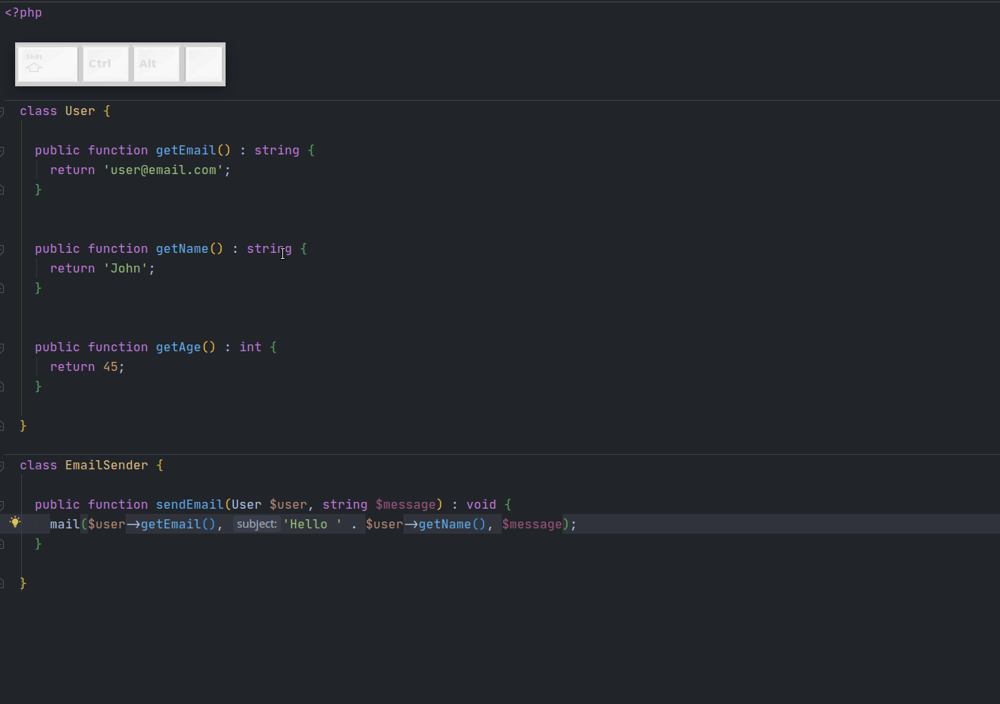
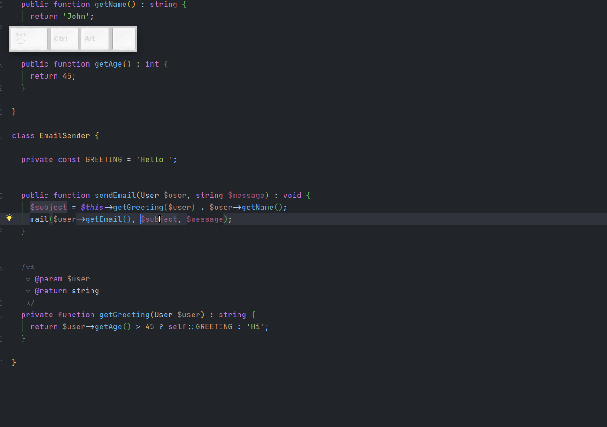

# Refactor: Introduce

Одна из наиболее полезных групп инструментов, по факту разделяется на 4 инструмента, но, по сути, логика работы у них одинаковая: вынести expression в переменную/константу/свойство/параметр. 
Особенно полезен вынос в переменную.

Стандартные шорткаты довольно легко запомнить - `Ctrl+Alt+Первая буква операции`:
- Introduce Variable - `Ctrl+Alt+V`
- Introduce Constant - `Ctrl+Alt+C`
- Introduce Field - `Ctrl+Alt+F`
- Introduce Parameter - `Ctrl+Alt+P`

Кстати, на этой гифке также продемонстрирована работа инструмента `Extract Method` (шорткат `Ctrl+Atl+M`). Он умеет выносить куски кода любого размера, сам определяет аргументы создаваемого метода, вам остается только поправить название и задать return type, хотя он и это попытается угадать. :smile:

 

Также есть обратная `Introduce` операция - `Inline`. 
