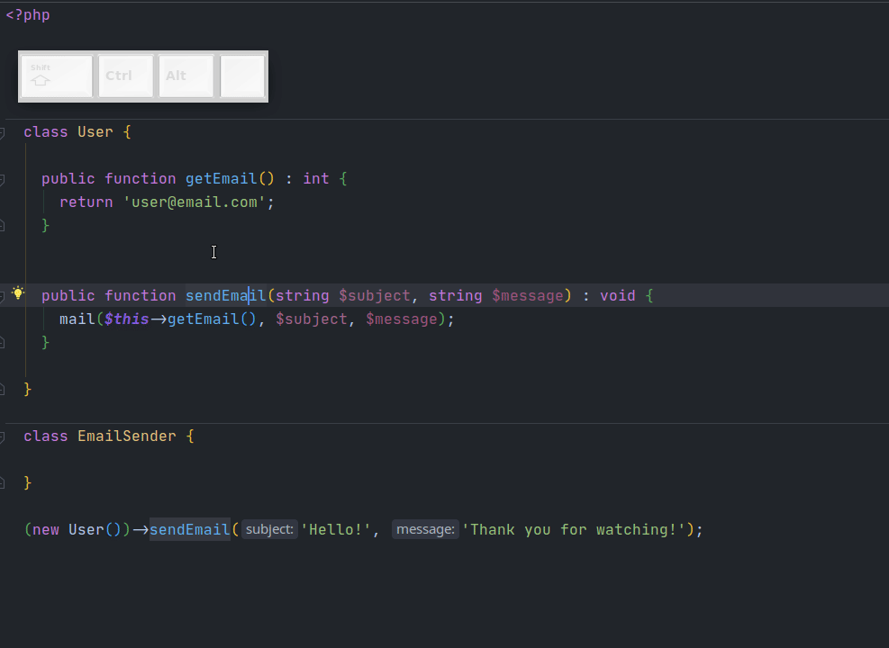

# Refactor: Move

Позволяет перемещать файлы, классы, неймспейсы и методы. После перемещения исправляет все места, которые ссылаются на перемещаемые элементы. Стандартный шорткат - `F6`. Для вызова каретка ввода должна находиться на элементе, который вы хотите переместить.

Вот так, например, происходит перенос метода: 

 

При переносе класса/неймспейса PhpStorm должен автоматически корректно определять директорию, в которую необходимо переместить класс. Если этого не происходит - надо настроить корневые неймспейсы в `Settings -> Directories`.

[https://www.jetbrains.com/help/phpstorm/settings-directories.html](https://www.jetbrains.com/help/phpstorm/settings-directories.html)
