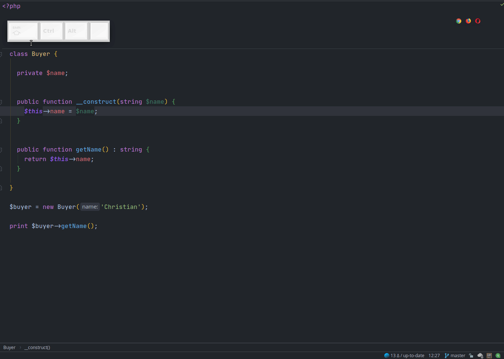

# Refactor: Rename

Базовый инструмент рефакторинга. Позволяет переименовывать переменные, файлы, методы, константы, классы, неймспейсы и т.д., а также все места, которые на них ссылаются. Стандартный шорткат - `Shrift + F6`. Для вызова каретка ввода должна находиться на элементе, который вы хотите переименовать.

