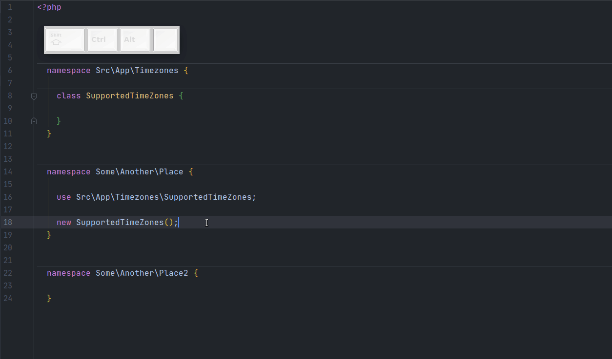
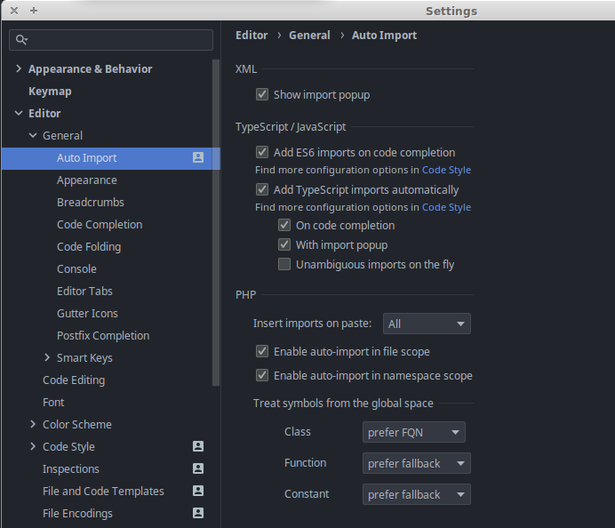

# Auto Import
Settings -> Editor -> General -> Auto Import

Нас интересует блок PHP.

Первая настройка -  `Insert imports on paste`, выбираем `All`.
Теперь при копипасте кода PhpStorm не будет спрашивать, надо ли импортировать классы.

 

## Auto-Import Conditions
В этом блоке настраиваются условия срабатывания авто-импорта. Ставим галочки `Enable auto-import in file scope` и `Enable auto-import in namespace scope`.
> Также настоятельно рекомендую выбрать `Treat symbols from the global space -> Class -> prefer FQN`.
> Иначе будут автоимпортиться классы из глобального неймспейса, что совершенно бессмысленно :man_shrugging:.

---

Вот так выглядят мои настройки на текущий момент (актуально на момент: PhpStorm 2021.3.1 Build #PS-213.6461.83, built on December 29, 2021):

